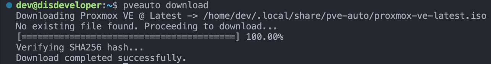

# PVE Auto | Proxmox Virtual Environment Auto Installer


## Table of Contents

- [Overview](#overview)
- [Features](#features)
- [Installation](#installation)
- [Usage](#usage)
- [License](#license)
- [Contact](#contact)
- [Contributing](#contributing)

## Overview

This repository is a Rust-based library and command-line tool designed to download and Verify Proxmox Virtual Environment ISO images automatically.

> [!Caution]
> This project is currently in early development stages.  
> Features and functionalities are subject to change.  
> Additionally, some features may not be fully implemented yet.

`PVE Auto` can also provide a means for [unattended installations of Proxmox VE](https://pve.proxmox.com/wiki/Unattended_installation_of_Proxmox) by embedding the necessary configuration files into the ISO image (if end-host configuration is known) or by serving them over the local network during the auto-installation process.

## Features

- Download the latest Proxmox VE ISO image automatically.
- Verify the integrity of the downloaded ISO using checksums.
- Embed unattended installation configuration files into the ISO image.
- Serve configuration files over the local network for auto-installation.
- Command-line interface for easy usage.

## Installation

### As a Library

Add the following to your `Cargo.toml`:

#### Using Cargo.toml

```toml
[dependencies]
pveauto = "0.1.0" # Replace with the latest version
```

#### Using Command Line

```bash
cargo add pveauto
```

### As a Command-Line Tool

You can install the command-line tool using Cargo:

```bash
cargo install pveauto
```

## Usage

`PVE Auto` can be used both as a library in your Rust projects and as a standalone command-line tool.

Currently only supported on Linux, might work on macOS but untested.

### As a Command-Line Tool (Installed)

```bash
Usage: pveauto <command> [options]

Commands:
  download [path]     Download Proxmox VE ISO to [path], defaults to:
                        $XDG_DATA_HOME/pve-auto/proxmox-ve-latest.iso
                        or ~/.local/share/pve-auto/proxmox-ve-latest.iso
  offline-installer   Create unattended ISO (offline; requires MGMT MAC)
  network-installer   Create unattended ISO (network; DHCP required)
  serve-answers       Start HTTP server for network installer
  exit                Exit program

```

### As a Command-Line Tool (via Cargo)

```bash
cargo run -- <command> [options]
```

### Example: Downloading The Latest Proxmox VE ISO

To download the latest Proxmox VE ISO image, run the following command:

```bash
pveauto download /optional/path/to/save/proxmox-ve-latest.iso
```

> [!Note]
> If no path is provided, the ISO will be saved to the default location:  
> `$XDG_DATA_HOME/pve-auto/proxmox-ve-latest.iso` or `~/.local/share/pve-auto/proxmox-ve-latest.iso`

#### Screenshot



### As a Library

Coming soon: Examples of how to use `PVE Auto` as a library in your Rust projects.

## License

This project is licensed under the MIT License - see the [LICENSE](LICENSE.txt) file for details

## Contact

Created by Anthony Tropeano

- [GitHub](https://github.com/iitoneloc)
- [Website](https://www.atropeano.com)

## Contributing

Contributions are welcome! Please feel free to submit issues and pull requests.
